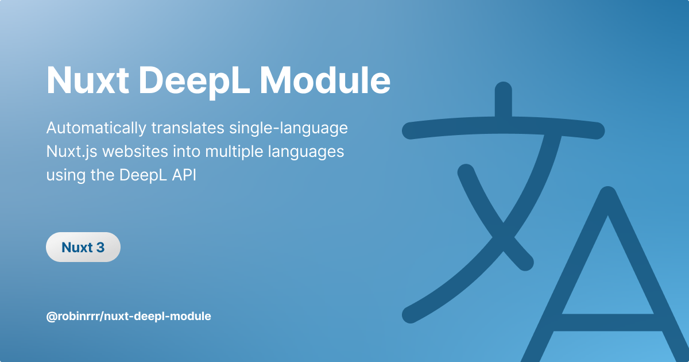
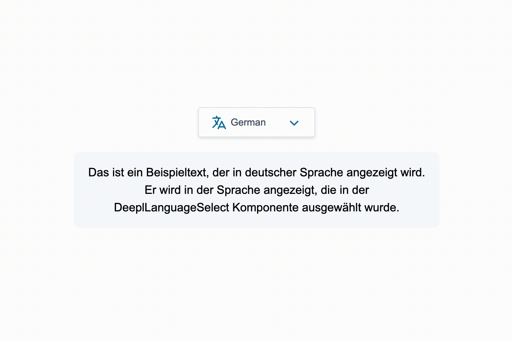

# Nuxt DeepL Module

[![npm version][npm-version-src]][npm-version-href]https://npmjs.com/package/nuxt-deepl-module
[![npm downloads][npm-downloads-src]][npm-downloads-href]https://npmjs.com/package/nuxt-deepl-module
[![License][license-src]][license-href]https://npmjs.com/package/nuxt-deepl-module
[![Nuxt][nuxt-src]][nuxt-href]https://nuxt.com

> The unofficial Nuxt DeepL Module offers a solution for transforming single-language Nuxt.js websites into multi-language sites without the complexities of manual translation. By using the DeepL API, this module automates the translation process, ensuring a seamless user experience across various languages.


### Features

- 🤖 **Automated Translation:** Translate website content into multiple languages using the DeepL API.
- ⚡️ **Caching:** Enhance performance by caching DeepL API responses
- 🗣️ **Pre-Build Component:** Pre-build user-friendly language selector component for easy language switching.
- 🍪 **Cookie-Based Preferences:** Remember user language preferences using cookie
- 🔒 **Secure DeepL Requests:** Maintain data privacy and security with a built-in proxy


### Requirements

- Nuxt.js 3.x or later
- A DeepL API account (please note: The Free Plan has a maximum limit of 1,500 characters)


### Installation and Setup

1. Install the module using npm or yarn:

   ```bash
   npm install nuxt-deepl-module
   yarn install nuxt-deepl-module
   ```
2. Add the module to your `nuxt.config.js` file:

   ```js
    export default {
      modules: ["nuxt-deepl-module"],
      deepl: {
        apiKey: null, // Pro or Free API Key
        apiType: "free",
        apiUrl: {
          pro: "https://api.deepl.com/v2",
          free: "https://api-free.deepl.com/v2",
        },
        glossaryPairs: [], 
        defaultLanguage: "de", // Default language of your content
        useCache: true,
        useCookie: true,
        debug: false,
      },
      runtimeConfig: {
        deepl: {
          // This can be overridden at runtime via the NUXT_DEEPL_API_KEY
          // environment variable.
          apiKey: ''
        }
      }
    };

   ```


### Usage

- **DeeplLanguageSelect Component:**
  Use the pre-built `DeeplLanguageSelect` component for a language selection interface.



```html
<template>
  <!-- Default Component with all languages -->
  <DeeplLanguageSelect />

  <!-- Component with selected languages and slots -->
  <DeeplLanguageSelect :selectedLanguages="['de', 'en', 'fr', 'it']">
    <template #button="{currentLanguage, isTranslating, isOpen}">
      ...
    </template>
    <template #menu="{selectedLanguages, setLanguage}">
      ...
    </template>
  </DeeplLanguageSelect
</template>
```

You can override the default styles with the template:

[Default Style CSS](https://github.com/Robinrrr/nuxt-deepl-module/blob/main/src/assets/style.css)

- **Directives :**
  Use the Directive to exclude elements (and child elements) from translation and updates (e.g.: for reactive elements)

```html
<template>
  <div>
    <!-- This text will not be translated -->
    <div v-deepl:disable>
      Hello I am an information text
    </div>

    <!-- 
     This button will be translated. However, 
     reactive changes will not be taken into account. 
     -->
    <button v-deepl:watch="false">
      {{ isOpen ? 'Close menu' : 'Open menu' }}
    </button>
  </div>
</template>
```

- **Composable:**
  Use the `useDeepl` composable to programmatically access the DeepL translation functionality within your Vue components.

```html
<script setup>
  import {onMounted} from 'vue';
  const deepl = useDeepl();

  const {
    currentLanguage, // readonly
    previousLanguage, // readonly
    defaultLanguage, // readonly
    cookieLanguage, // readonly
    isTranslating, // readonly
    setLanguage,
  } = deepl;

  /* Switch language to French */
  onMounted(() => {
    /* Works for client-side only */
    setLanguage('fr')
  });

</script>
```

- **Global `$deepl` property:**

```html
<template>
  <!-- Show the current active language -->
  <div>
    {{ $deepl.currentLanguage }}
  </div>
</template>
```


### Future Development

- **SSR Support:**
  Translate pages on server side
- **Auto generated language routes:**
  Generate route prefixes like `/de/` or `/fr/` based on defined languages


## Buy me a coffee

<a href="https://www.buymeacoffee.com/robinrrr" target="_blank"></a>


## Contribution

```bash
# Install dependencies
npm install

# Generate type stubs
npm run dev:prepare

# Develop with the playground
npm run dev

# Build the playground
npm run dev:build

# Run ESLint
npm run lint

# Run Vitest
npm run test
npm run test:watch

# Release new version
npm run release
```

[npm-version-src]: https://img.shields.io/npm/v/nuxt-deepl-module/latest.svg?style=flat&colorA=020420&colorB=00DC82
[npm-version-href]: https://npmjs.com/package/nuxt-deepl-module
[npm-downloads-src]: https://img.shields.io/npm/dm/nuxt-deepl-module.svg?style=flat&colorA=020420&colorB=00DC82
[npm-downloads-href]: https://npmjs.com/package/nuxt-deepl-module
[license-src]: https://img.shields.io/npm/l/nuxt-deepl-module.svg?style=flat&colorA=020420&colorB=00DC82
[license-href]: https://npmjs.com/package/nuxt-deepl-module
[nuxt-src]: https://img.shields.io/badge/Nuxt-020420?logo=nuxt.js
[nuxt-href]: https://nuxt.com
